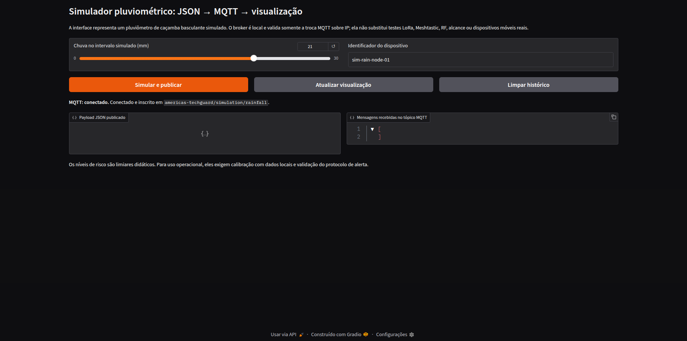
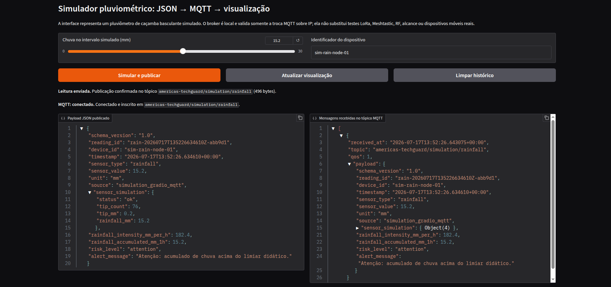
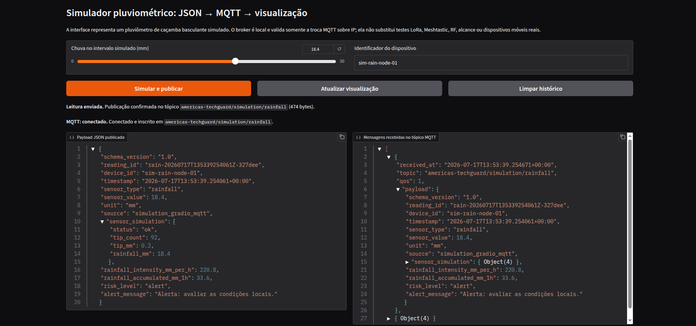
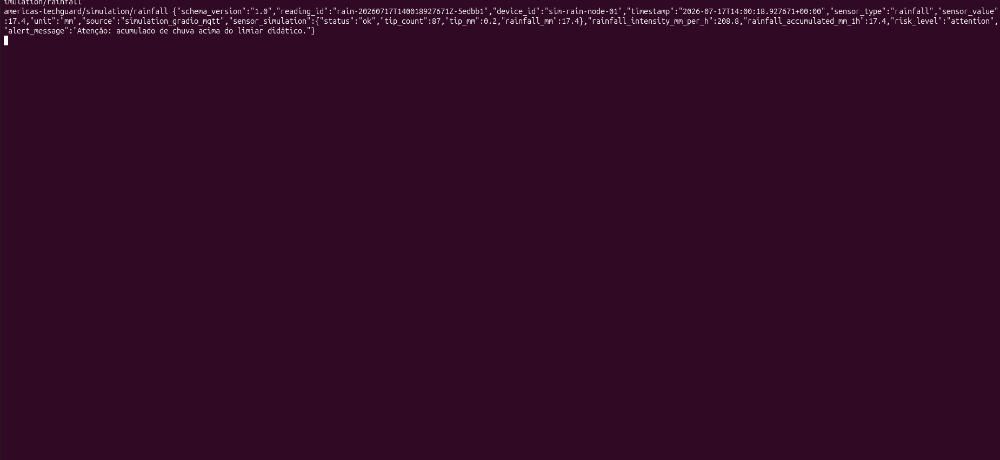

# Integração LoRa-Meshtastic, JSON e Alertas Ambientais

**Estudante:** Mateus Zanco Tatsch
**Tema:** Integração LoRa-Meshtastic, JSON e Alertas Ambientais para Dispositivos Móveis

## Objetivo e escopo

Esta prova de conceito didática simula leituras pluviométricas, organiza os dados em JSON, valida o contrato, calcula intensidade e acumulado de chuva, classifica risco e prepara uma mensagem curta de alerta. Como demonstração complementar, uma interface Gradio publica e recebe mensagens em um broker MQTT local.

O objetivo é representar a cadeia de dados que, em uma etapa futura, poderia ligar sensores ambientais a uma arquitetura LoRa/Meshtastic, processamento de borda e alertas móveis do Americas TechGuard. Não houve acesso a placas LoRa, sensores físicos, antenas, GPS, nós Meshtastic ou local de ensaio; portanto, esta entrega valida a lógica de software e a troca MQTT/IP local, não alcance, RF, PDR, SNR, latência, consumo ou entrega em celulares reais.

| Item | Entregue nesta atividade |
| --- | --- |
| Dados | Pluviômetro de caçamba basculante **simulado**, com 0,2 mm por basculamento. |
| JSON | Contrato versionado com identificação, horário ISO 8601, localização sintética, leitura, unidade, risco, alerta e origem. |
| Processamento | Validação, erros auditáveis, intensidade, acumulado móvel de 1 h e quatro níveis de risco. |
| Evidências | Notebook executado, JSONs em `outputs/`, auditoria de payload, falhas simuladas, interface Gradio e capturas MQTT. |
| Integração local | Docker Compose com Gradio, Paho MQTT e Mosquitto em `127.0.0.1`. |
| Não entregue | Rádio LoRa, firmware Meshtastic, sensores físicos, malha, app móvel, alcance e alerta operacional. |

## Relação com o Americas TechGuard

Inundações exigem observação contínua, interpretação rápida e disseminação de informação compreensível. O JSON definido aqui desacopla a origem da leitura — sensor, API, satélite ou simulação — do processamento e do canal de entrega. A mesma estrutura pode futuramente alimentar um nó Meshtastic, um broker MQTT, banco de séries temporais, dashboard e mensagens a usuários.

```text
ENTREGUE AGORA
pluviômetro simulado → JSON canônico → validação/riscos → alerta curto
                                      ├→ arquivos de evidência
                                      └→ MQTT local → interface Gradio

ETAPA FÍSICA FUTURA (não executada)
sensor real → nó LoRa/Meshtastic → malha 915 MHz → gateway IP/MQTT
                                                     └→ dados, dashboard e alertas móveis
```

## Referências técnicas aplicadas

### Artigo principal: LoRaWAN para monitoramento e alerta de inundações

Zakaria, Jabbar e Sulaiman tratam a falta de informação de nível d’água em tempo real em áreas de drenagem, que reduz o tempo de resposta de autoridades e população antes de transbordamentos. O sistema dos autores combina sensor ultrassônico HC-SR04, Arduino, alimentação solar, LoRa/LoRaWAN, gateway e as plataformas TTN, TagoIO e ThingSpeak; classifica condições como segura, alerta, cautela e perigosa e avalia RSSI, SNR, PDR e atraso para SF7 e SF12.

O artigo mostra como sensores de baixo custo, conectividade de longo alcance e baixo consumo e plataformas IoT apoiam alertas: o sensor mede o fenômeno, o nó transmite poucos bytes, o gateway conecta à camada IP e a plataforma armazena, visualiza e encaminha informação à decisão humana. Isso requer calibração, energia autônoma, cobertura e política de alerta — não somente transmissão.

**Aproveitado:** leitura ambiental, níveis de risco explícitos, mensagem curta, preocupação com tamanho de payload, noção de gateway/dashboard e necessidade de métricas de enlace em uma PoC física. **Adaptado:** em vez do sensor ultrassônico de nível d’água, foi simulado um pluviômetro; basculamentos são convertidos em mm, intensidade em mm/h e acumulado móvel de uma hora. **Não reproduzido:** HC-SR04, Arduino, gateway LoRaWAN, TTN/TagoIO/ThingSpeak, energia solar, ensaio de campo e métricas de rádio. Nenhum valor de enlace foi inventado como medição.

### Artigo complementar: Meshtastic/LoRa mesh e borda conteinerizada

Garzon Andosilla e Rugeles apresentam uma arquitetura de campus inteligente nas camadas de percepção, rede, borda/processamento e aplicação. Um nó sensor solar mede irradiância; nós intermediários atuam como `ROUTER`; um RAK4631 como `GATEWAY` participa da malha e encaminha payloads Meshtastic decodificados como JSON/MQTT pela rede Wi-Fi.

Na borda, um Raspberry Pi 4 executa Docker Compose: Mosquitto recebe MQTT, Node-RED extrai/transforma campos, InfluxDB persiste séries temporais, Meshview mostra topologia e Grafana apresenta dashboards. O artigo também apresenta nó externo com painel solar/bateria e *managed flooding* com cache de IDs para reduzir duplicatas e priorização associada a SNR. O resultado de 2,47 km pertence ao campus dos autores e não é extrapolado para este projeto.

**Aproveitado:** separação por camadas, JSON/MQTT como ponte de borda, Docker Compose, Mosquitto, identificação da leitura para deduplicação didática, auditoria de payload e visualização simples. **Simplificado:** há somente broker local e Gradio; não há nós `CLIENT`/`ROUTER`/`GATEWAY` reais, Node-RED, InfluxDB, Meshview, Grafana, energia solar ou roteamento de malha.

### LoRa, LoRaWAN, Meshtastic e MQTT

| Conceito | Papel | Tratamento nesta atividade |
| --- | --- | --- |
| **LoRa** | Tecnologia física de rádio sub-GHz, longo alcance e baixo consumo. | Prevista para a PoC futura; nenhum rádio foi transmitido. |
| **LoRaWAN** | Protocolo LPWAN, geralmente em estrela, com nós, gateways e servidor de rede. | Referência arquitetural do artigo principal; não foi implementado. |
| **Meshtastic** | Firmware/ecossistema que usa LoRa em malha descentralizada, com integração IP opcional. | Referência para futura comunicação móvel/off-grid; nenhum nó foi configurado. |
| **MQTT/JSON** | Mensageria IP e formato de dados para integração de sistemas. | JSON é validado no notebook; Gradio/Mosquitto demonstram MQTT local. Não é pacote de rádio Meshtastic. |

## Arquitetura implementada

O notebook é a fonte de verdade do contrato completo e das evidências determinísticas. A aplicação web demonstra o transporte MQTT local.

```text
Notebook (Python / biblioteca padrão)
chuva sintética → caçamba simulada → JSON completo → validador
→ intensidade + acumulado 1 h → risco + alerta → outputs/*.json

Aplicação local (Docker Compose)
controle Gradio → payload demonstrativo → Paho MQTT → Mosquitto
→ assinatura do mesmo tópico → JSON na interface e no terminal
```

O Mosquitto está exposto somente em `127.0.0.1`. A configuração anônima serve exclusivamente ao desenvolvimento local, não à produção.

## Contrato JSON canônico

O contrato usa `schema_version: "1.0"`. Latitude e longitude são **sintéticas**, usadas apenas para demonstrar formato, validação e futuras integrações.

```json
{
  "schema_version": "1.0",
  "reading_id": "sim-20260716-0003",
  "device_id": "sim-rain-node-01",
  "node_name": "Pluviômetro simulado 01",
  "timestamp": "2026-07-16T12:10:00-03:00",
  "latitude": -26.3,
  "longitude": -48.84,
  "altitude_m": null,
  "sensor_type": "rainfall",
  "sensor_value": 16.0,
  "unit": "mm",
  "source": "simulation",
  "sensor_simulation": {"status": "ok", "tip_count": 80, "rainfall_mm": 16.0, "reason": null},
  "rainfall_intensity_mm_per_h": 192.0,
  "rainfall_accumulated_mm_1h": 21.0,
  "risk_level": "alert",
  "alert_message": "ALERTA: chuva acumulada em 1 h: 21.0 mm. Acompanhe os avisos oficiais.",
  "processing_status": "accepted"
}
```

O exemplo está em [outputs/processed_readings.json](outputs/processed_readings.json) e no [envelope MQTT simulado](outputs/meshtastic_mqtt_envelope_simulated.json).

| Campo | Regra / finalidade |
| --- | --- |
| `schema_version` | Versiona o contrato. |
| `reading_id`, `device_id`, `node_name` | Identificam leitura, origem e nó; o ID apoia deduplicação. |
| `timestamp` | ISO 8601 com fuso explícito; formatos inválidos são rejeitados. |
| `latitude`, `longitude`, `altitude_m` | Localização; latitude em `[-90, 90]` e longitude em `[-180, 180]`. |
| `sensor_type`, `sensor_value`, `unit` | Nesta PoC: `rainfall`, valor não negativo e `mm`. |
| `source` | Declara a procedência; nesta execução é sempre `simulation`. |
| `sensor_simulation` | Estado, basculamentos e causa de falha, se houver. |
| Campos `rainfall_*` | Intensidade e acumulado de 1 h derivados pelo código. |
| `risk_level`, `alert_message` | Resultado da regra e texto curto para futura disseminação. |
| `processing_status`, `errors` | Auditabilidade: aceitação ou rejeição com erros estruturados. |

### Regra didática de risco

O risco é calculado pelo acumulado móvel em uma hora; a intensidade permanece como contexto. Os limiares não são orientação de Defesa Civil nem acionamento real e devem ser calibrados por dados locais e responsáveis competentes.

| Chuva acumulada em 1 h | Nível | Interpretação didática |
| --- | --- | --- |
| `< 5 mm` | `safe` | Monitoramento normal. |
| `5 a < 20 mm` | `attention` | Acompanhamento de avisos oficiais. |
| `20 a < 40 mm` | `alert` | Condição a avaliar localmente. |
| `≥ 40 mm` | `critical` | Situação prioritária para futuro protocolo institucional. |

### Auditoria de tamanho

O notebook compara JSON canônico e uma representação compacta de chaves curtas, sob orçamento didático de 250 bytes. Nas quatro leituras executadas, o canônico variou de **579 a 597 bytes**; o compacto, de **199 a 215 bytes**. A evidência está em [outputs/payload_size_audit.json](outputs/payload_size_audit.json). Isso ilustra o compromisso entre contexto/auditabilidade e tamanho; não mede Time-on-Air, protobuf, criptografia, fragmentação ou limite de pacote Meshtastic.

> O payload da interface Gradio demonstra publicação MQTT local. Ele não substitui o contrato canônico completo do notebook — em especial, não adiciona as coordenadas sintéticas. A conformidade com os campos mínimos está nos JSONs processados e no notebook.

## Implementação e evidências

### Notebook e arquivos verificáveis

O notebook [lora_meshtastic_integration_json_environmental_alerts_mobile_devices.ipynb](notebooks/lora_meshtastic_integration_json_environmental_alerts_mobile_devices.ipynb) gera quatro leituras válidas, uma para cada risco, e trata timestamp, localização, unidade e falhas de sensor inválidos sem interromper o lote.

| Evidência | Resultado |
| --- | --- |
| [Resumo](outputs/execution_summary.json) | 4 entradas, 4 aceitas e um caso por nível de risco. |
| [Leituras processadas](outputs/processed_readings.json) | Intensidade, acumulado, risco e mensagem. |
| [Leituras rejeitadas](outputs/rejected_readings.json) | Timestamp, coordenada, unidade e sensor inválidos. |
| [Falhas de sensor](outputs/sensor_faults_simulated.json) | `timeout`, contador travado e reset de contador. |
| [Falhas de transmissão](outputs/transmission_faults_simulated.json) | Perda, atraso e duplicata determinísticos: 3 recebimentos, 1 perda e 1 duplicata ignorada. |
| [Auditoria de payload](outputs/payload_size_audit.json) | Bytes canônicos e compactos. |

As falhas de transmissão são cenários injetados para exercitar deduplicação e auditoria; não são medições de PDR, RSSI, SNR ou atraso de rádio.

### Interface Gradio e broker MQTT

A aplicação converte chuva simulada em basculamentos, publica JSON no tópico `americas-techguard/simulation/rainfall` e assina o mesmo tópico para exibir a mensagem recebida. Os envios seguintes atualizam o acumulado e o nível de risco.



*Figura 1 — Gradio conectado e inscrito no tópico MQTT local.*



*Figura 2 — Publicação confirmada, payload exibido e mensagem recebida pelo broker.*



*Figura 3 — Acumulado simulado classificado como `critical`; o limiar é didático.*



*Figura 4 — Payload JSON observado via assinatura do tópico MQTT local.*

As figuras comprovam uma troca MQTT/IP entre contêineres locais; não comprovam transmissão LoRa, saltos de malha ou entrega a dispositivos móveis.

## Como executar

### Pré-requisitos

- Python 3.14.4 e `.venv` para o notebook.
- Docker e Docker Compose para a interface e o broker.
- Portas locais `7860` (Gradio) e `1883` (Mosquitto) livres em loopback.

### Notebook

Na raiz do repositório:

```bash
.venv/bin/python -m pip install -r requirements.txt
.venv/bin/jupyter lab
```

Abra o notebook principal e execute **Run All**. Ele não exige hardware, rede ou credenciais e grava as evidências em `outputs/`.

### Interface e MQTT local

`.env` é local e ignorado pelo Git. Em um clone novo:

```bash
cp .env_example .env
docker compose up --build
```

Abra `http://127.0.0.1:7860`. Para encerrar:

```bash
docker compose down
```

Se ainda existir uma imagem anterior, force a reconstrução:

```bash
docker compose down
docker compose up --build
```

Para observar publicações em outro terminal:

```bash
docker compose exec mqtt mosquitto_sub \
  -h localhost -p 1883 -v \
  -t 'americas-techguard/simulation/rainfall'
```

### Dependências principais

| Componente | Versão / uso |
| --- | --- |
| Python | 3.14.4 no notebook; imagem `python:3.12-slim` na aplicação. |
| JupyterLab / ipykernel | `4.6.1` / `7.3.0`, notebook. |
| Gradio / Paho MQTT / Requests | `5.31.0` / `2.1.0` / `2.32.3`, interface e cliente MQTT. |
| Eclipse Mosquitto | `2.1.2-alpine`, broker local no Compose. |

## Entrega atual versus sistema operacional

| Tema | Entregue agora | Necessário antes de campo |
| --- | --- | --- |
| Sensores | Pluviômetro simulado e falhas planejadas. | Instalar/calibrar pluviômetro; adicionar nível de rio por radar, pressão ou ultrassom; tratar vedação, manutenção, ruído e *debounce*. |
| Rádio | Nenhum. | Confirmar placa/transceptor/pinagem, região, antena e configurar Meshtastic `CLIENT`/`ROUTER`/`GATEWAY` em 915 MHz quando autorizado. |
| Enlace | Perda/atraso/duplicata simulados. | Medir RSSI, SNR, PDR, latência, Time-on-Air, consumo e cobertura sob obstáculos reais. |
| Dados | JSON validado e MQTT local. | Gateway IP, TLS, autenticação, retenção, observabilidade, banco de séries temporais e backups. |
| Visualização | Notebook, arquivos, terminal e Gradio. | Dashboard operacional, mapa, histórico, qualidade de enlace e controle de acesso. |
| Alertas | Texto didático. | App Meshtastic/canais institucionais, usuários, confirmação, escalonamento e protocolo de resposta humana. |
| Governança | Sem dados reais ou credenciais. | Limiares hidrológicos locais, Defesa Civil, privacidade, responsabilidades e testes de aceitação. |

## Possibilidades futuras para o Americas TechGuard

- Integrar **pluviômetros** e sensores de **nível de rios**, preservando no JSON tipo, unidade, localização e qualidade de cada medição.
- Consumir fontes autorizadas de **companhias de água** e órgãos públicos, registrando origem, horário de atualização e incerteza.
- Associar **dados satelitais**, radar e modelos de **nowcasting**, separando observação, previsão e confiança do modelo.
- Evoluir para dashboards de séries temporais, mapa, alarmes, estado de nós e qualidade de enlace, inspirados na camada de borda do artigo complementar.
- Aplicar IA a anomalias, fusão de dados ou previsão somente após histórico representativo, validação contínua e revisão humana. IA não deve disparar alertas críticos sem governança.

## Limites de segurança

Esta PoC não é um sistema de emergência e não deve orientar evacuação, interdição ou resposta a desastre. Os limiares e coordenadas são didáticos; o MQTT local não usa TLS/autenticação. JSON MQTT não equivale a mensagem de rádio, segurança de canal ou telemetria nativa do Meshtastic.

## Referências

1. SENAI/SC. *Período 8 — Integração LoRa-Meshtastic, JSON e Alertas Ambientais para Dispositivos Móveis*. Material de atividade fornecido ao estudante.
2. Zakaria, M. I.; Jabbar, W. A.; Sulaiman, N. [*Development of a smart sensing unit for LoRaWAN-based IoT flood monitoring and warning system in catchment areas*](https://doi.org/10.1016/j.iotcps.2023.04.005). *Internet of Things and Cyber-Physical Systems*, 2023.
3. Garzon Andosilla, R.; Rugeles Uribe, J. [*A Meshtastic-based LoRa Mesh System for Smart Campus Applications: From Solar-Powered Sensing to Containerized Data Management*](https://arxiv.org/abs/2605.20379), 2026.
4. Meshtastic. [MQTT Module Configuration](https://meshtastic.org/docs/configuration/module/mqtt/).
5. Meshtastic. [Telemetry Module Configuration](https://meshtastic.org/docs/configuration/module/telemetry/).

## Licença

Este projeto está sob [licença MIT](LICENSE). Artigos e documentações citados permanecem sujeitos às respectivas licenças e condições de uso.
